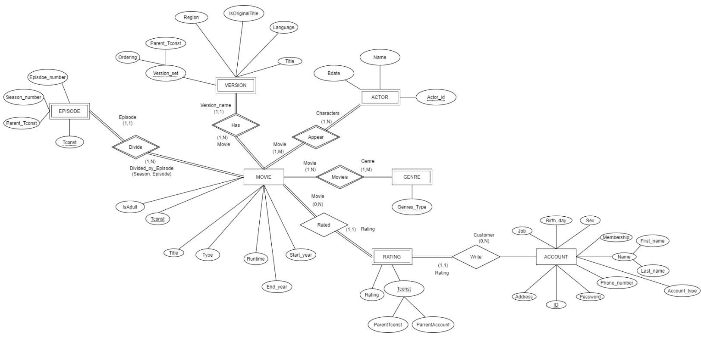
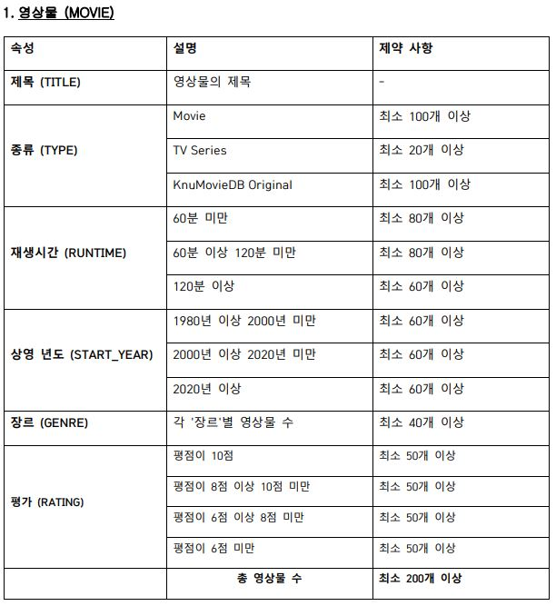
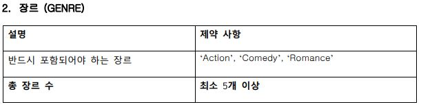
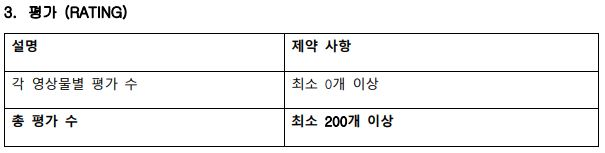
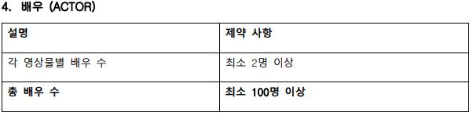
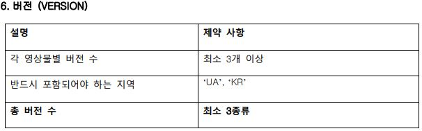
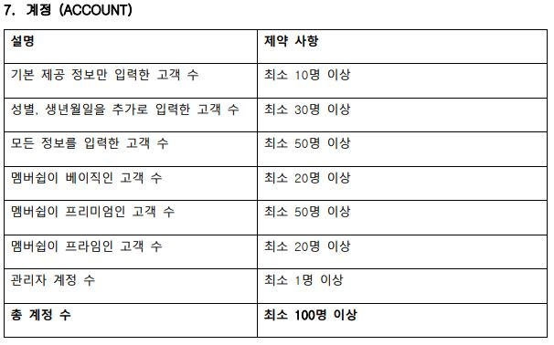
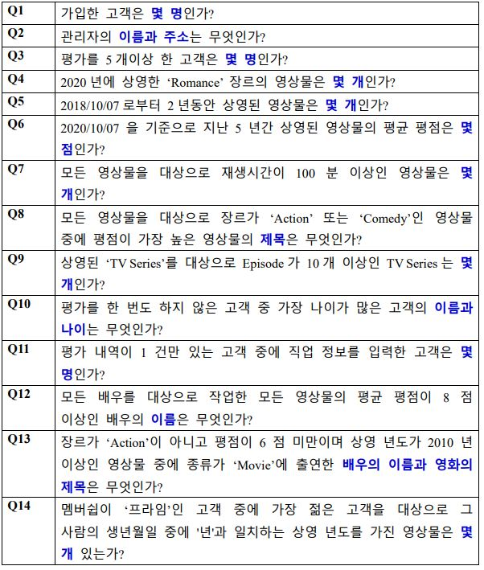
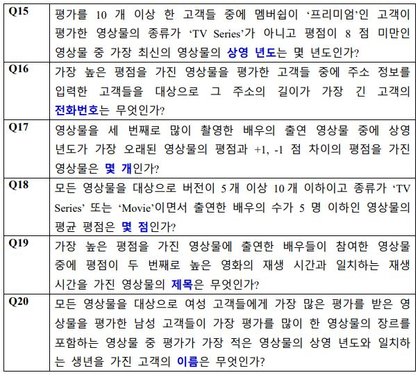

# 2020-2 DB Project  With Kim Kihyun, Ahn Sangjun, Lee Sangmin
## Phase1
___
### ER Diagram

상세 설명

1. Entity
   1. MOVIE(영상물) : ‘knuMovieDB’에서 취급하는 영상물로서 다양한 영상물을 총칭한다. 극장 상영 영화, 스트리밍 전용 영화, TV에서 방영되는 에피소드 등을 포함한다.

   2. GENRE(장르) :  MOVIE의 장르를 나타낸다.

   3. RATING(평가) :  ACCOUNT(customer)가 남긴 영상물에 대한 평가를 나타낸다. 각 영상물은 0개 이상의 평가를 가질 수 있다.

   4. ACTOR(배우) :  MOVIE에 출연한 배우(들)의 정보이다.

   5. EPISODE(에피소드) : MOVIE의 시즌과 에피소드에 대한 정보를 나타낸다.

   6. VERSION(버전) : 상영되는 나라에서의 MOVIE 정보를 나타낸다

   7. ACCOUNT(계정) : knuMovieDB’의 사용자를 나타낸다.  ‘관리자’ (admin) 계정과 ‘고객’ (customer)의 계정으로 이루어져 있다.

2. Attributes
    1. MOVIE(영상물)의 Attributes
       1. Summary(Key) : 영상물의 main 줄거리이다.(string)
       2. Movie_id(Key) : 영상물의 고유한 식별 번호이다.(string) -> 만약 영상물이 많아 integer 허용 범위를 초과할 수 도 있으니까 string으로 선언했다.
       3. Title : 영상물의 main 제목이다.(string)
       4. Type : 영상물의 종류(극장 상영 영화, 스트리밍 전용 영화, TV에서 방영되는 에피소드)를 나타낸다.(string)
       5. Release_date : 영상물의 처음 상영일을 나타낸다.

    2. GENRE(장르)의 Attributes
       1. Genre_name(Key) : 영상물의 장르(로맨스, 공포, 액션 등...)의 이름을 나타낸다.(string), MOVIE is GENRE의 관계에서 영상물의 장르를 알 수 있다.

    3. RATING(평가)의 Attributes
       1. Rating_id(Key) : RAITING의 고유한 식별 번호이다.(string) -> 만약 평가가 많아 integer 허용 범위를 초과할 수 도 있으니까 string으로 선언했다.
       2. Comment : 댓글.(STRING)
       3. Score : 해당 RATING의 별점(min: 0.0, max: 5.0)이다.(DOUBLE) 

    4. ACTOR(배우)의 Attributes
       1. Actor_id(Key) : ACTOR의 고유한 식별번호이다.(string) 
       2. Real_name : 배우의 실제 이름이다.(string)
       3. Movie : 배우가 출연한 작품들이다.(string)  
    	예시> '김수현'은 '사이코지만 괜찮아','별에서 온 그대'에 출연했다.  
	    3-1)Role_name : 작중 이름이다.(string)

    5. EPISODE(에피소드)의 Attributes
       1.  Episode_number(Key) : Episode 회차를 나타낸다.(integer)
       2. Video_time : 영상물의 영상 시간을 나타낸다.(string)
       3. Season_number(Key) : 무슨 Season인지 나타낸다.(integer)
       4. Title : 해당 시즌의 에피소드의 영상물의 제목을 나타낸다.(string)
       5. Summary : 해당 시즌의 에피소드의 영상물의 줄거리를 나타낸다.(string)  
	    예시>'사이코지만 괜찮아'의 main 줄거리가 있으며, 시즌1의 에피소드1의 '악몽을 먹고 자란 소년'의 줄거리가 있다. 이 Summary는 후자의 줄거리를 나타낸다.

    6. VERSION(버전)의 Attributes
       1. Version_id(Key) : VERSION의 고유한 식별 번호이다.(string)
       2. Region : 지역(나라)를 나타낸다.(string)
       3. Title_of_region : 해당 지역(나라)에서의 영상물의 제목을 나타낸다(string).

    7. ACCOUNT(계정)의 Attributes (*처리는 반드시 입력받아야 하는 Attirubute)
       1. *ID(Key) : 계정의 ID(string)    
       2. Birth_day : 생일(integer)
       3. Job : 직업(string)
       4. Sex : 성별(string)
       5. Membership : 'NULL','Basic','Premium','Prime' 등급으로 차별화됨.(string) (admin일 경우 'NULL')
       6. *Name  
	    6-1)First_name : 이름(string)  
	    6-2)Last_name : 성(string)
       7. Account_type : Admin인지 Customer인지 나타낸다(string)
       8. *Phone_number : 휴대폰 번호(string)
       9. *Password : 비밀번호(string)
       10. *Address : 주소(string)

3. Relationships
   1. Divide(The MOVIE is divided into EPISODES)
       - Relationship cardinality : (1,1) - (1,N)
       - 하나의 영상물은 에피소드들로 나누어진다. 
       - 예시> '워킹데드'(시리즈 물)는 시즌1에서 에피소드1~6, 시즌 2에서 에피소드 1~13, 시즌3, ... , 시즌 9에서 에피소드 1~16로 나누어진다.
       - 예시> '도둑들'(영화)는 시즌1에서 에피소드1로 나누어진다.
       - 예시> '사이코지만 괜찮아'는 시즌1에서 에피소드 1~16개로 나누어진

    2. Has(MOVIE has VERSION)
       - Relationship cardinality : (1,N) - (1,1)
       - 하나의 영상물은 버전을 가진다.  
        예시> 한국에서는 '겨울왕국'이지만, 미국에서는 'Frozen', 일본에서는 'アナと雪の女王'(안나와 눈의 여왕)이다.

    3. Appear(ACTOR appear MOVIE)
       - Relationship cardinality : (1,N) - (1,M)
       - 배우는 영상물에 출연한다.  
         예시>'김고은'은 '도깨비'에 출연한다.  
         예시>'공유'는 '도깨비'에 출연한다.  
         예시>'공유'는 '부산행'에 출연한다. 

    4. Is(MOVIE is GENRE)
        - Relationship cardinality : (1,N) - (1,M)
        - 영화는 ~~한 장르이다.  
        예시>'도둑들'은 '액션'장르이다. '도둑들'은 어드벤처' 장르이다. '도둑들'은 '범죄' 장르이다.

    5. Rated(MOVIE is rated by RATING)
        - Relationship cardinality : (0,N) - (1,1)
        - 영상물은 평가에 의해 평가되어 진다.  
        예시> '도깨비'에 Rating1이 평가되어졌다. '도깨비'에 Rating2가 평가되어졌다.  
        예시> '도둑들'에 Rating3이 평가되어졌다.

    6. Manages(ACCOUNT(Admin) manages MOVIE)
        - Relationship cardinality : (0,N) - (1,M)
        - Admin이 영상물을 관리(편집, 삽입..)한다.  
        예시> 관리자1이 '도깨비'를 관리한다.  
        예시> 관리자2가 '도깨비를' 관리한다.  
        예시> 관리자1이 '도둑들'을 관리한다.  
        예시> 관리자3은 어떠한 영상도 관리하지 않았다. (아이디만 만들어 놓은 상태)

    7. Write(ACCOUNT(customer) write RATING)
       - Relationship cardinality : (0,N) - (1,1)
       - 고객이 평가를 적는다. 그 후, (5)Rated에 의해 영상물이 평가되어진다. 
        예시>고객1이 '도둑들'에 대한 평가를 작성한다.

    8. MANAGES(ACCOUNT(Admin) manages ACCOUNT(Customer))
        - Relationship cardinality : (0,N) - (0,M)
        - 관리자가 고객들을 관리(고객 ban, 고객 정보 파악)한다.
        예시> 'admin1'이 악성 댓글을 작성한 'customer1'을 정지시킨다(manage).

 

## Phase2
___
### Relational Database Design

상세 설명

- 설명 내용
  - SQL 동작 환경 및 실행 방법 등 설명하고자 하는 사항들
- Oracle SQL을 사용함
  - imdb dataset을 바탕으로 ( https://www.imdb.com/interfaces/ ) 프로젝트에서 필요한 정보들만 parsing하여서 추출하였다.
- Data Set 설명 (Team6-phase2-1.txt)
  - MOVIE : 영화 테이블
    - Tconst : 각 영상물의 고유한 식별자, primary key
    - Title : 영상물 제목
    - Type : 영상물의 Type에 대한 정보, 'Movie'(영화), 'KnuMovieDB Original'(해당 사이트 만의 영화), 'Tv_series'(시즌과 에피소드) 로 구성되어 있다. 
    - Runtime : 상영시간
    - Start_year : 영상물 출시 연도
    - End_year : 영상물이 상영을 종료한 연도
    - IsAdult : 성인 영화인지에 대한 정보
  - GENRE : 장르 테이블
    - Genre_Type : 장르에 대한 정보를 가짐, primary key  
    예시> 'Romance', 'Action', 'SF'...
  - RATING : 평가 테이블
    - ParentAccount : 평가한 고객의 고유 식별자
    - ParentTconst : 평가 당한 영상물의 고유 식별자
    - Rating : 고객이 해당 영상물에 평가한 점수
    - Primary Key는 (ParentAccount, ParentTconst)이다.
  - ACTOR : 배우 테이블
    - Actor_id : 배우 고유 식별자, primary key
    - Name : 배우 이름
    - Bdate : 배우 탄생 연도
  - EPISODE : 에피소드 테이블
    - Tconst : 에피소드로 등록하 영상물의 고유 식별자, primary key
    - ParentTconst : 제일 처음에 등록된 에피소드(즉, 시즌1 에피소드1)의 영상물의 고유 식별자
    - SeasonNumber : 시즌 정보
    - EpisodeNumber : 에피소드 정보
  - VERSION : 버전에 대한 정보, 버전이란 각 나라마다 제목이 다를 수 있으므로 이에 대한 정보 저장을 위한 릴레이션
    - ParentTconst : 등록할 영상물의 고유 식별자
    - Ordering : 순서
    - Title : 등록할 버전의 영상물 제목
    - Region : 등록할 버전의 영상물이 상영될 지역(나라)  
    예시> KR, UK, EU 
    - Language : 언어
    - IsOriginalTitle : 해당 영상물이 원작의 제목인가에 대한 정보
  - ACCOUNT : 고객 테이블
    - Account_ID : 고객 ID, primary key
    - Password : 고객 비밀번호
    - Fname : 이름
    - Lname : 성
    - Phone_number : 휴대폰 번호(xxx-xxxx-xxxx)
    - Address : 주소
    - Sex : 성별, 'M'와 'F'로 저장
    - Bdate : 생년월일(xxxx-xx-xx)
    - Membership : 멤버십, 'Basic', 'Premium', 'Prime' 3가지가 있다.
    - Account_type : 일반 고객인지 관리자 계정인지 파악(0 : user, 1 : admin)
    - Job : 직업
  - APPEAR : MOVIE에 등장하는 ACTOR에 대한 관련 테이블
    - ParentActor_id : 해당 영상물에 등장하는 Actor 고유 식별자
    - ParentTconst : 해당 영상물의 고유 식별자
    - Primary key는 (ParentActor_id, ParentTconst)이다.
  - MOVIEIS : MOVIE와 GENRE에 대한 관련 테이블
    - ParentTconst : 해당 영상물의 고유 식별자
    - ParentGenreType : 해당 영상물의 장르
    - Primary key는 (ParentTconst, ParentGenreType)이다.
- 삭제 설정 : on cascade
  - ALTER TABLE EPISODE ADD FOREIGN KEY(ParentTconst) REFERENCES MOVIE (Tconst) ON DELETE CASCADE;
  - ALTER TABLE RATING ADD FOREIGN KEY(ParentAccount) REFERENCES ACCOUNT (Account_ID) ON DELETE CASCADE;
  - ALTER TABLE RATING ADD FOREIGN KEY(ParentTconst) REFERENCES MOVIE (Tconst) ON DELETE CASCADE;
  - ALTER TABLE VERSION ADD FOREIGN KEY(ParentTconst) REFERENCES MOVIE (Tconst) ON DELETE CASCADE;
  - ALTER TABLE APPEAR ADD FOREIGN KEY(ParentActor_id) REFERENCES ACTOR (Actor_id) ON DELETE CASCADE;
  - ALTER TABLE APPEAR ADD FOREIGN KEY(ParentTconst) REFERENCES MOVIE (Tconst) ON DELETE CASCADE;
  - ALTER TABLE MOVIEIS ADD FOREIGN KEY(ParentTconst) REFERENCES MOVIE (Tconst) ON DELETE CASCADE;
  - ALTER TABLE MOVIEIS ADD FOREIGN KEY(ParentGenreType) REFERENCES GENRE (Genre_Type) ON DELETE CASCADE;
  - 각 테이블에 ON DELETE CASCADE를 해줌으로써, FK로 연결되어 있는 정보가 사라지면 해당 튜플을 삭제하도록 처리했다.
- 아래의 데이터 제약 조건을 고려하여 CREATE, INSERT 진행.
  - 
  - 
  - 
  - 
  - 
  - 
  - 
 
- 튜플 삽입(Team6-phase2-2.txt)
  - imdb dataset을 바탕으로 ( https://www.imdb.com/interfaces/ ) 프로젝트에서 필요한 정보들만 parsing하여서 txt 파일을 생성하였다.
 
- 쿼리문 예제(Team6-phase2-3.txt)
  -  

 

## Phase3
___
### JDBC Database Application

상세 설명

1. 실행을 하시면 콘솔 창에
   1. 1.login 과 2. Sign_in 이 있으면 원하는 기능의 번호를 입력합니다.

2. 
   1. login 선택
      1. ID와 PASSWORD를 입력합니다.
      2. 이때, DB에 등록되지 않은 (ID,PASSWORD)인 경우 'ID가 없거나 PassWord가 틀렸습니다.'라는 메시지와 함께 (1)으로 돌아갑니다.

            관리자 로그인 
            ID : ukHyQ3832 
            PASSWORD : lhY449 

            추천 사용자 로그인 
            ID : NbCTz4497 
            PASSWORD : pTB681 

   2. Sign_in 선택
      1. 차례대로 회원등록에 필요한 정보(ID,PassWord,Fname,Lname,Phone_number,Address,Sex,Birth_day,Job)들을 입력합니다.
           1. 이때, (*)는 필수로 기입하셔야하는 정보이며, (*)가 없는 정보들은 기입하고싶지 않으시면 null을 입력하시면 DB에 null값으로 입력됩니다.
           2. 이때, 기존의 DB에 등록된 ID가 있을 경우 에러메시지를 표시하고 프로그램이 종료됩니다.
   
3. login이 성공적으로 된 후
   1. login에 성공한 ID가 회원일 경우
      1. 회원이 평가하지 않은 모든 MOVIE의 TITLE을 출력합니다.
      2. 다음과 같은 선택지가 등장 합니다.
           1. 초기 Title View로 돌아가기) 
	        -> 3-1-1)이 실행됩니다.
           2. 영상물 선택  
	        -> 영상물의 TITLE을 입력하면, 해당하는 영화의 title이 있을경우 해당 영화의 정보를 출력하고, 평가를 할 수 있게 합니다.
           3. 영상물 검색)  
	        -> 영상물의 TITLE, TYPE, GENRE, VERSION순으로 검색을 합니다. 기본적으로 모든 검색은 옵션적으로 일어나며, 각각 검색의 입력을 원치 않을 경우 ENTER의 입력으로 넘어 갈 수 있습니다.GENRE는 OR 연산으로 진행하는 MULTI SEARCH 기능을 넣었으며, Romance, SF와 같이 입력하면 ROMANCE OR SF장르의 영화를 보여주게 됩니다.
            4. 내가 평가한 영상물)  
	        -> 자신이 평가한 영상물의 리스트와 자신이 평가한 평점, 평균 평점을 보여줍니다.
            5. 회원정보 수정)  
  	        -> 비밀번호, 이름, 전화번호, 주소, 성별, 생일, 직업을 수정할 수 있습니다.
            6. 회원 탈퇴)  
	        -> 회원 탈퇴를 할 경우 해당 ACCOUNT 정보를 DB에서 DELETE합니다.
            7. 종료)  
	        -> JDBC가 종료되며, 수정된 내용들이 DB에 안전하게 저장됩니다.
   2. login에 성공한 ID가 ADMIN일 경우) (admin ID : wBsQU6026, PW : zPs401)
       1. 모든 MOVIE의 TITLE을 출력합니다.
       2. 회원으로 login한 경우와 동일한 선택지 + 7.관리자 모드가 선택지로 등장합니다.
          1. 초기 Title View로 돌아가기)  
	    -> 3-2-1)이 실행됩니다.
          2. 영상물 선택)  
	        -> 3-1-2-1)가 실행됩니다.
          3. 영상물 검색)  
	    -> 3-1-2-2)가 실행됩니다.
          4. 내가 평가한 영상물)  
	    -> 관리자 권한으로 평가한 영상물을 검색할 시, 모든 사용자가 부여한 평점과 각각 평균 평점을 볼 수 있습니다.
          5. 회원정보 수정)  
	    -> 3-1-2-4)와 동일
          6. 회원 탈퇴)  
	    -> 3-1-2-5)와 동일
          7. 종료)  
	    -> 3-1-2-6)과 동일
          8. 관리자 모드)  
	    -> admin ID로 접속했을때만 보이며 '1.새 영상물 등록 2.등록된 영상물 정보 수정' 선택지가 있다.
             1. 새 영상물 등록
                - 차례대로 등록할 영화의 정보를 입력하며 (*)는 필수       기입해야한다.
        	        - 입력 예시> GoodDB / Tv_series / 18 / 1997-08-20 / 2020-08-20 / n /
                - Genre를 입력합니다.
      	            - 입력 예시> 등록할 장르가 Romance, Comedy 일 경우 23 입력
	              
	            - 출연한 배우를 등록합니다. 
                	   - 등록할 배우 수를 입력(ex> 2)
             	       - 배우의 이름과 탄생년도를 입력합니다
             	       - 이때, DB에 등록된 배우가 아닐 경우 DB에 새롭게 등록하고 있는 경우 DB에 있는 배우를 MOVIE에 출연한다고 DB에 입력됩니다.
               - 등록할 영화의 version을 선택합니다.  
	                ->n을 입력할 경우, version은 앞에서 입력한 영화의 Title이 original로 등록되며, KR에서만의 version만 입력됩니다.
	                ->y를 입력할 경우, version을 추가로 입력할 수 있습니다.
      	        - 등록하는 영화의 Type이 Tv_series일 경우 (시즌, 에피소드)를 추가로 입력 하셔야합니다.  
	                ->이때, (첫 시즌 첫 에피소드일 경우 등록할 영상물의 Title 입력) ->예) La flagellation1 / 6 / 1 입력(La flagellation1의 6시즌 1에피소드라는 뜻)(기존에 있던 시즌일 경우 해당 Title 입력) (Title의 1시즌 1에피소드 라는 뜻)
             2. 등록된 영상물 정보 수정
            	- title수정을 선택한경우 
	                ->Movie의 Title과 Version의 동일한 Title값들 수정 
            	- Type수정을 선택한경우  
	                ->Movie의 Type값 수정
              	- Start_year,End_year수정을 선택한경우  
	                ->Movie의 Start_year,End_year값 수정
                - IsAdult수정을 선택한경우  
	                ->Movie의 Isadult값 수정
              	- Genre수정을 선택한경우  
    	            - 장르들중 바뀌었으면 하는 장르값 입력  
    	                - 바뀔장르값 입력  
    		                - Movieis에서 ParentGenretype = 바뀌었으면 하는 장르값, ParentTconst = 본래의 영화의 Tconst값일때, ParentGenretype값에 바꿀 장르값을 집어넣어준다.

 

## Phase4
___
### Movie Website Construction
- youtube(presentation) : https://youtu.be/FMUvGEnXg5k
- youtube(demo) : https://youtu.be/UZwzqdtpTwg

KimKiHyun